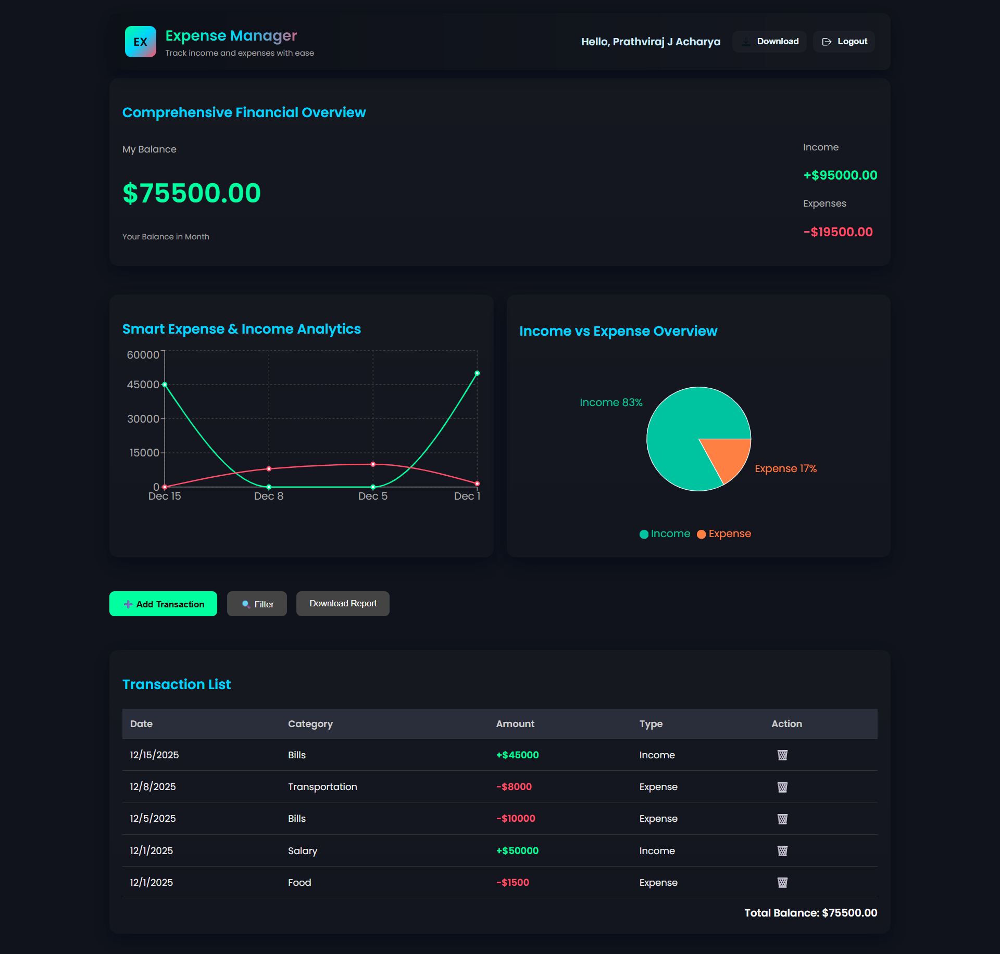
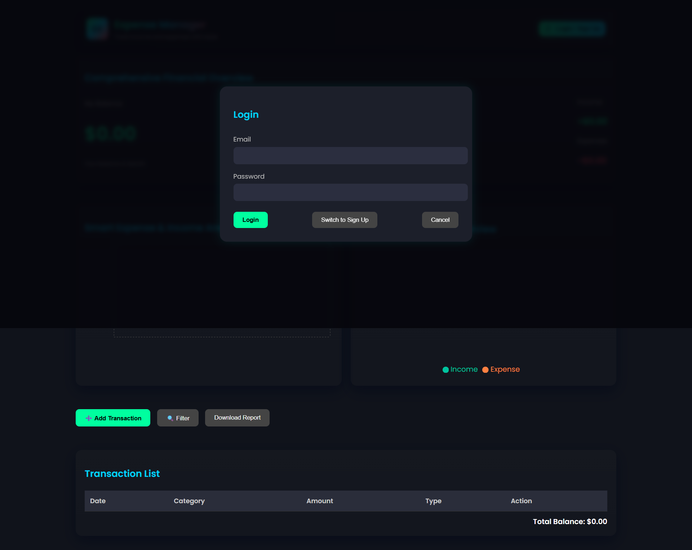
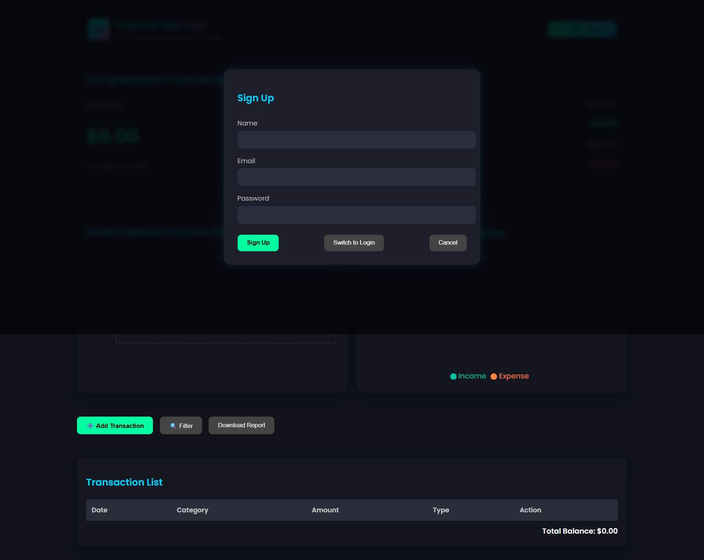

# Expense Tracker - Frontend

A modern Expense Tracker application built with React to help you manage your personal finances efficiently. Track your income and expenses, visualize your financial data with charts, and stay on top of your budget.

## 🔗 Backend Repository
[https://github.com/prathviraj-03/FIN-TRACK-BACKEND](https://github.com/prathviraj-03/FIN-TRACK-BACKEND)

## 📸 App Screenshots

### Dashboard


### Login


### Signup


## ✨ Features

- **User Authentication**: Secure Login and Signup functionality.
- **Dashboard Overview**: View your current balance, total income, and total expenses at a glance.
- **Transaction Management**: Add new income or expense transactions easily.
- **Visual Reports**:
  - **Overview Pie Chart**: Visualize the distribution of your expenses.
  - **Summary Charts**: Analyze your financial trends.
- **Filtering**: Filter transactions to find specific records.
- **Responsive Design**: Works seamlessly on desktop and mobile devices.

## 🛠️ Tech Stack

- **Frontend**: React.js
- **Styling**: CSS
- **HTTP Client**: Axios
- **Charts**: Chart.js

## 🏗️ Architecture

This project follows the **MERN Stack** architecture (MongoDB, Express.js, React.js, Node.js).

- **Frontend (Client)**: Built with **React.js**, it handles the user interface and state management. It communicates with the backend via RESTful APIs using **Axios**.
- **Backend (Server)**: Built with **Node.js** and **Express.js**, it provides API endpoints for user authentication and transaction management.
- **Database**: **MongoDB** is used to store user data and transaction records.
- **Authentication**: JSON Web Tokens (JWT) are used for secure user authentication and authorization.

## 📂 Project Structure

```
EXPENCE-TRACKER/
├── expemce-tracker-frontend/   # Frontend React Application
│   └── exp-tracker/
│       ├── public/             # Static assets
│       └── src/
│           ├── components/     # Reusable UI components
│           ├── api.js          # API service configuration
│           └── App.js          # Main application component
│
└── expence-tracker-backend/    # Backend Node.js Application
    ├── config/                 # Database configuration
    ├── controllers/            # Request handlers
    ├── middleware/             # Custom middleware (Auth)
    ├── models/                 # Mongoose models (User, Transaction)
    ├── Routes/                 # API route definitions
    └── server.js               # Server entry point
```

## 🚀 Getting Started

This project was bootstrapped with [Create React App](https://github.com/facebook/create-react-app).

### Prerequisites

- Node.js installed on your machine.
- npm or yarn package manager.

### Installation

1. Clone the repository.
2. Navigate to the project directory:
   ```bash
   cd expemce-tracker-frontend/exp-tracker
   ```
3. Install dependencies:
   ```bash
   npm install
   ```

### Running the Application

In the project directory, you can run:

```bash
npm start
```

Runs the app in the development mode.\
Open [http://localhost:3000](http://localhost:3000) to view it in your browser.

The page will reload when you make changes.\
You may also see any lint errors in the console.

## 📜 Available Scripts

### `npm test`
Launches the test runner in the interactive watch mode.

### `npm run build`
Builds the app for production to the `build` folder.
It correctly bundles React in production mode and optimizes the build for the best performance.

### `npm run eject`
**Note: this is a one-way operation. Once you `eject`, you can't go back!**

## 📄 License

This project is open source and available under the [MIT License](LICENSE).
